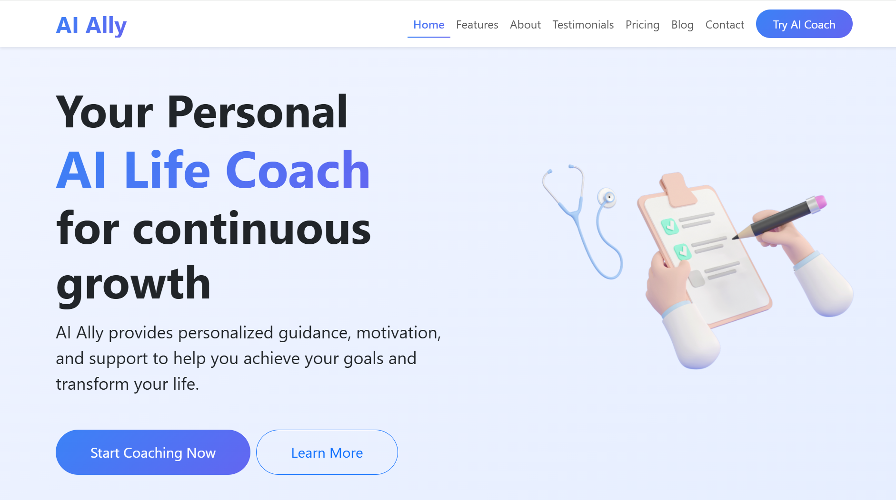
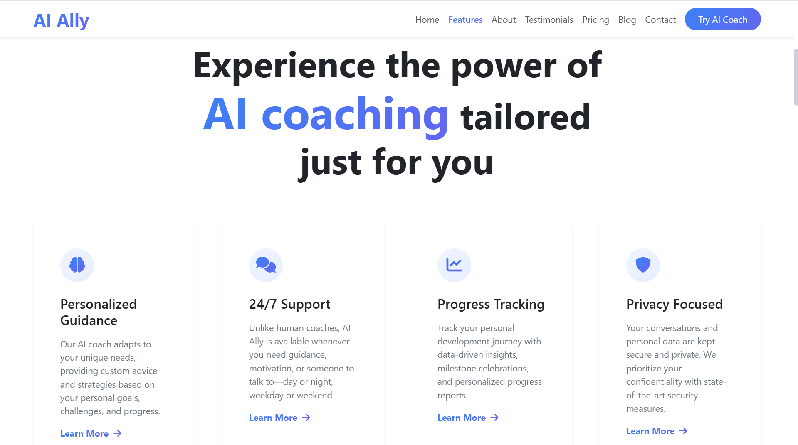
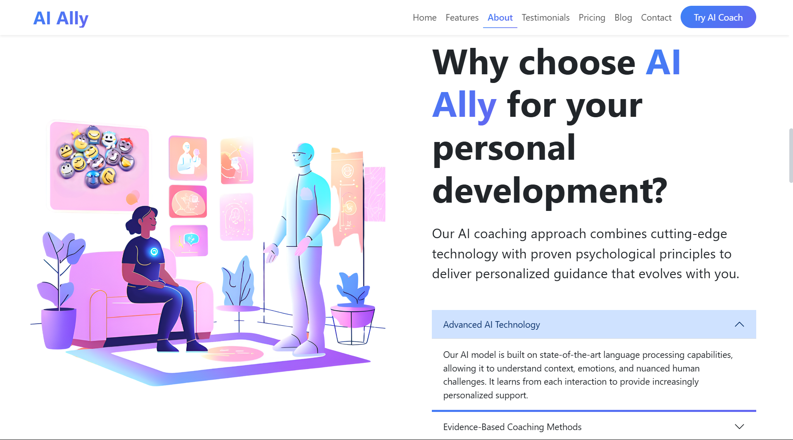
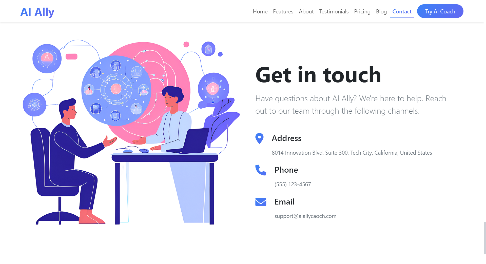
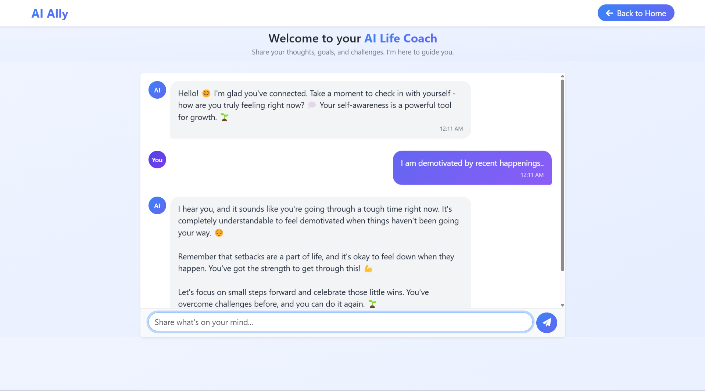

# 🧠 AI Personal Life Coach

A virtual companion providing personalized guidance, emotional support, and actionable insights to help navigate life's challenges.

## 📋 Overview

AI Personal Life Coach leverages artificial intelligence to create a supportive, non-judgmental environment where users can discuss their concerns, set goals, and receive personalized guidance. The system combines therapeutic techniques with practical advice to deliver a holistic coaching experience.

## 📑 Contents

- [AI Model](#-ai-model)
- [Features](#-features)
- [Screenshots & Demos](#-screenshots--demos)
- [Technology Stack](#-technology-stack)
- [Installation](#-installation)
- [Usage](#-usage)
- [How It Works](#️-how-it-works)
- [Project Structure](#-project-structure)
- [Contributing](#-contributing)
- [Future Enhancements](#-future-enhancements)
- [License](#-license)
- [Acknowledgments](#-acknowledgments)
- [Contact](#-contact)

## 🤖 AI Model

This project uses **Google's Gemini 2.0 Flash** model through the Google Generative AI API. Gemini is a powerful, multimodal AI model that offers:

- Advanced natural language understanding
- Contextual awareness for meaningful conversations
- Fast response times for real-time coaching
- Ability to remember conversation context and provide personalized guidance

## ✨ Features

- **Personalized Guidance** 🎯: Tailored advice based on your specific situation and goals
- **Emotional Support** 💙: Empathetic responses that acknowledge your feelings and experiences
- **Goal Setting & Tracking** 📝: Help identifying and working toward meaningful objectives
- **Mindfulness Practices** 🧘‍♂️: Techniques to reduce stress and improve mental well-being
- **Actionable Insights** 💡: Practical steps and strategies you can implement immediately
- **24/7 Availability** ⏰: Support whenever you need it, day or night
- **Private & Secure** 🔒: Your conversations remain confidential
- **Network Status Monitor** 🔄: Real-time connection monitoring for improved reliability
- **Consistent UI Experience** 🖥️: Standardized header design across all pages

## 📸 Screenshots & Demos

### Application Screenshots

<div align="center">
  <h4>Landing Page</h4>
  
  
  
  
  
  <h4>AI  Interface</h4>
  
</div>

### Demo Videos

<div align="center">
  <h4>Download and View Demo Videos</h4>
  <a href="https://github.com/anugrahk21/Personal_AI_Life_Coach/raw/main/static/assets/videos/landing-page-demo.mp4">
    
  </a>
  &nbsp;&nbsp;
  <a href="https://github.com/anugrahk21/Personal_AI_Life_Coach/raw/main/static/assets/videos/live-working-demo.mp4">
    
  </a>
</div>

*Note: Click the buttons above to download and view the demo videos locally on your device*

## 💻 Technology Stack

- **Backend**: Python, Flask
- **Frontend**: HTML, CSS, JavaScript
- **AI**: Google Generative AI (Gemini API)
- **Deployment**: Local server (with cloud deployment options)

## 🚀 Installation

1. Clone this repository:
```
git clone https://github.com/anugrahk21/Personal_AI_Life_Coach.git
cd AI_Personal_Life_Coach
```

2. Install dependencies:
```
pip install -r requirements.txt
```

3. Set up your Gemini API key:
   - Create a `.env` file in the root directory
   - Add your API key: `GEMINI_API_KEY=YOUR GOOGLE GEMINI 2.0 FLASH API`
   - You can get an API key from: https://makersuite.google.com/app/apikey

4. Run the application:
```
python app.py
```

5. Open your browser and navigate to the URL displayed in your terminal:
```
http://localhost:5000
```
Note: The port may vary depending on your system configuration or if port 5000 is already in use. The application will display the correct URL when it starts.

## 🔍 Usage

1. Start a conversation by typing a message in the input field
2. Share your thoughts, challenges, or goals with the AI coach
3. Receive personalized guidance and support
4. Continue the conversation to explore topics in depth

## ⚙️ How It Works

### AI Implementation

This project transforms Google's Gemini 2.0 Flash model into a compassionate, motivational life coach through careful system design and prompt engineering.

#### Therapeutic Personality Design

The AI coach's personality has been meticulously crafted by providing specific instructions that shape how it responds:

- **Empathetic First Approach**: The system is programmed to always validate emotions before offering guidance, creating a supportive experience similar to human therapeutic interactions.

- **Conversational Memory**: The coach maintains conversation history to provide contextually relevant responses that reference previous discussions, creating a coherent coaching experience.

- **Carefully Structured Responses**: All AI outputs are formatted with:
  - Short, digestible paragraphs (2-3 sentences maximum)
  - Strategic use of line breaks for readability
  - Bullet points for actionable suggestions
  - Appropriate emotional tone markers (emojis) used sparingly

- **Motivational Framework**: The coach incorporates positive psychology principles, focusing on strengths and growth potential rather than just problem-solving.

#### Technical Implementation

The core coaching capabilities are implemented in the `TherapistCoach` class within `coach.py`:

1. **System Instruction**: A comprehensive prompt establishes the coach's personality, communication style, and therapeutic approach.

2. **Context Management**: The system tracks conversation history and session duration to provide personalized responses.

3. **Response Enhancement**:
   - Therapeutic openers ensure responses begin with empathetic acknowledgment
   - Periodic integration of motivational quotes to inspire and encourage
   - Fallback mechanisms for graceful handling of API issues

4. **Web Integration**: The Flask application in `app.py` serves as the interface between the user and the AI coach, handling request processing and response formatting.

The custom prompt engineering ensures the Gemini model behaves consistently as a life coach rather than a general information system, focusing on emotional support, personal growth, and actionable guidance.

## 📁 Project Structure

```
AI_Personal_Life_Coach/
├── app.py                # Main Flask application
├── coach.py              # TherapistCoach implementation
├── README.md             # Project documentation
├── requirements.txt      # Python dependencies
├── __pycache__/          # Compiled Python files
├── static/               # Static assets
│   ├── assets/           # Images, videos and resources
│   │   ├── favicon/      # Favicon files
│   │   ├── img/          # Image resources and screenshots
│   │   └── videos/       # Demo videos
│   ├── css/              # Stylesheets
│   └── js/               # JavaScript files
└── templates/            # HTML templates
    ├── index.html        # Landing page
    └── coachai.html      # Coach interface
```

## 🤝 Contributing

Contributions are welcome! Please feel free to submit a Pull Request.

1. Fork the repository
2. Create your feature branch: `git checkout -b feature/amazing-feature`
3. Commit your changes: `git commit -m 'Add some amazing feature'`
4. Push to the branch: `git push origin feature/amazing-feature`
5. Open a Pull Request

## 🔮 Future Enhancements

- Voice interaction capabilities 🎤
- Mobile application version 📱
- Integration with health tracking devices ⌚
- Specialized coaching modules (career, relationships, health) 🌟
- Multilingual support 🌍

## 📝 License

This project is licensed under the MIT License - see the LICENSE file for details.

## 👏 Acknowledgments

- Google for providing the Gemini AI capabilities
- Flask team for the web framework
- HTML5, CSS3, and JavaScript for frontend development

## 📬 Contact

Anugrah K - anugrah.k910@gmail.com

Project Link: [Click Here](https://github.com/anugrahk21/Personal_AI_Life_Coach)
